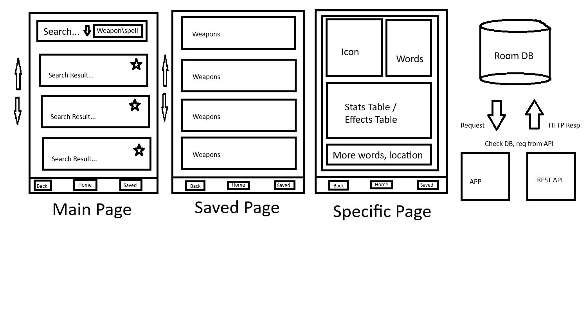

# COMP3717 Will Otterbein Mini App
Will Otterbein, 2025

This document describes the application idea and design decisions.

## References
Resources used in the creation of this application.

[Room DB Documentation](https://developer.android.com/training/data-storage/room)
[Room DB One-to-many relationships](https://developer.android.com/training/data-storage/room/relationships/one-to-many)
[Elden Ring REST API Documentation](https://docs.eldenring.fanapis.com/)

---
## Idea: Elden Ring Equipment Quick Reference
Elden Ring is a big game, a huge game -- some say one of the biggest games.

There are a lot of items / armour / weapons / sourceries and incantations to choose from
when playing through the game, and frankly it can be cumbersome to pull open a bunch of
wiki pages to find info about a specific weapons level requirements or stats.

Hence: **EldenRingQuickRef** -- title to be refined -- a quick reference for elden ring=
equipment.
- Uses API to get information about game equipment
	- RESTful component of the assignment
- Provide the user w/ ability to query wrt to specific equipment
- Provide the user w/ bookmarking capabilities -- save items to local storage w/ tags.
	- Search by tags
	- Room component of the assignment
- Should be snappy -- that is to say quick and easy.
	- Room component also -- cache API responses

---
## Part 1: App structure
The following section outlines my intentions for the structure of the application.

My idea for the structure of the application can be summarised in the following diagram



- There are four pages
	- Home page, users can search for equipment and save certain API res data to local storage.
		- User refine the search based of equipment type
		- Users save equipment items based off the equipment type
		- Local storage is organized based off the type that the user was searching for
	- Saved page, presents the user w/ the categories where they have stored items
		- Users can query their saved equipment items based off tags
	- Info page, present the information of the item in depth
		- Structure the api response data in a nice manner
		- Icon of the equipment

---
## Part 2: Data Structure
This section will explain the intended models of the data items for the application to use.

The above mentioned provides endpoints for querying wrt to
- Locations
- Items
- Weapons / Armour / sourceries / Incantations 
- Enemies
- Creatures

The scope of the application could be to provide the user w/ quick access
to information regarding any of the above, however I thought it best to start
w/ a more restricted subset of the games content and go from there -- hence weapons/armour/sourceries/incantations.

### Items
The schema for items is defined as follows:

| ATTRIBUTE        |      TYPE      |   DESCRIPTION |
| ------------- | :-----------: | -----: |
| id         | `string` | Id of the item |
| name         | `string` | Name of the item |
| image         | `string` | Image URL of the item icon |
| description         | `string` | Short description of the item |
| type         | `string` | Type of item |
| effect         | `string` | What the item does when given, consumed or used to upgrade things |

Endpoints:

| METHOD        |      URL      |   DESCRIPTION |
| ------------- | :-----------: | -----: |
| `GET`         | https://eldenring.fanapis.com/api/items | This route retrieves a list of all the items of **Elden Ring**. |
| `GET`         | https://eldenring.fanapis.com/api/items/:item_id | This route retrieves one **Elden Ring** item using its ID. |

Supported item request parameters for reference:

| Parameter        |      default value      | Example URL |  DESCRIPTION |
| ------------- | :-----------: | -----: |  -----: |
| `limit`        | 20 | https://eldenring.fanapis.com/api/items?limit=100 | This parameter is used to set the maximum amount of items in the response |
| `page`         | 0 | https://eldenring.fanapis.com/api/items?limit=20&page=3 | This parameter is used no navigate between pages of results |
| `name`         | none | https://eldenring.fanapis.com/api/items?name=White%20Cipher%20Ring  | This parameter is used to search for fields by their names |

This could be represented by the following Room db entity:

```kotlin
@Entity(tableName = "er_item")
data class ERItem (
	@PrimaryKey val id: String,
	val name: String,
	val imageUrl: String,
	val description: String,
	val type: String,
	val effect: String
)
```

### Weapons
The schema for weapons is defined as follows:

| ATTRIBUTE        |      TYPE      |   DESCRIPTION |
| ------------- | :-----------: | -----: |
| id         | `string` | Id of the Weapon |
| name         | `string` | Name of the Weapon |
| image         | `string` | Image URL of the Weapon |
| description         | `string` | Short description of the Weapon |
| category         | `string` | What category of Weapons. Example: `Axe`, `Sword`, etc. |
| weight          | `number` | How much the Weapon weights when equipped |
| attack         | `{ name: string, amount: number }` | How much damage the Weapon does when used as a weapon  |
| defence         | `{ name: string, amount: number }` | How much damage the Weapon blocks when used to defend an attack  |
| requiredAttributes         | `{ name: string, amount: number }` | What are the required attribute amount in order to properly use this Weapon. Example: `{ name: "Str", amount: 20 }`  |
| scalesWith         | `{ name: string, scaling: string }` | How much the Weapon scales and with what attributes. Example: `{ name: "Str", scaling: "B" }`  |

Endpoints:

| METHOD        |      URL      |   DESCRIPTION |
| ------------- | :-----------: | -----: |
| `GET`         | <https://eldenring.fanapis.com/api/weapons> | This route retrieves a list of all the weapons of **Elden Ring**. |
| `GET`         | <https://eldenring.fanapis.com/api/weapons/:weapon_id> | This route retrieves one **Elden Ring** weapon using its ID. |

Supported weapon request parameters for reference.

| Parameter        |      default value      | Example URL |  DESCRIPTION |
| ------------- | :-----------: | -----: |  -----: |
| `limit`        | 20 | <https://eldenring.fanapis.com/api/weapons?limit=100> | This parameter is used to set the maximum amount of items in the response |
| `page`         | 0 | <https://eldenring.fanapis.com/api/weapons?limit=20&page=3> | This parameter is used no navigate between pages of results |
| `name`         | none | <https://eldenring.fanapis.com/api/weapons?name=Forked%20Hatchet>  | This parameter is used to search for fields by their names |


This could be represented by the following Room db entity:

```kotlin

@Entity(tableName = "er_weapon")
data class ERWeapon (
	@PrimaryKey val id: String,
	val name: String,
	val imageUrl: String,
	val description: String,
	val category: String,
	val weight: float,
)
```

#### Attack Values
Entity corresponds to the attack type values, ex holy, bleed, etc.

Defense value entity.

This could be represented by the following Room db entity:

```kotlin
@Entity(tableName = "er_attack")
data class ERDefense (
	@PrimaryKey val id: String,		// Also FK to weapon
	val name: String,
	val amount: int
)
```

#### Defense Values
Entity corresponds to the defens value of the weapon, when using it to block.

Defense value entity.

```kotlin
@Entity(tableName = "er_defense")
data class ERDefense (
	@PrimaryKey val id: String,		// Also FK to weapon
	val name: String,
	val amount: int
)
```

#### Scaling Values
Scaling value entity.

This could be represented by the following Room db entity:

Types
- attack 
- defense

```kotlin
@Entity(tableName = "er_scaling")
data class ERScaling (
	@PrimaryKey val id: String,		// Also FK to weapon
	val name: String
	val scaling: String
)
```

### Armour
The schema for armour is defined as follows:

| ATTRIBUTE        |      TYPE      |   DESCRIPTION |
| ------------- | :-----------: | -----: |
| id         | `string` | Id of the armor piece |
| name         | `string` | Name of the armor piece |
| image         | `string` | Image URL of the armor piece |
| description         | `string` | Short description of the armor piece |
| category         | `string` | Category of the armor piece. Example: `Leg Piece`, `Helmet`, etc. |
| weight         | `number` | How much this armor piece weights in your invetory |
| dmgNegation         | `{name: string, amount: number}` | How much damage this armor piece negates. Example: `{ "name": "Strike", amount: 6 }`|
| resistance         | `{name: string, amount: number}` | How much resistance wearing this armor piece provides. Example: `{ "name": "Poise", amount: 10 }`|

Endpoints:

| METHOD        |      URL      |   DESCRIPTION |
| ------------- | :-----------: | -----: |
| `GET`         | https://eldenring.fanapis.com/api/armors | This route retrieves a list of all the armor pieces of **Elden Ring**. |
| `GET`         | https://eldenring.fanapis.com/api/armors/:ammo_id | This route retrieves one **Elden Ring** armor piece using its ID. |

Supported armour request parameters for reference:

| Parameter        |      default value      | Example URL |  DESCRIPTION |
| ------------- | :-----------: | -----: |  -----: |
| `limit`        | 20 | https://eldenring.fanapis.com/api/armors?limit=100 | This parameter is used to set the maximum amount of items in the response |
| `page`         | 0 | https://eldenring.fanapis.com/api/armors?limit=20&page=3 | This parameter is used no navigate between pages of results |
| `name`         | none | https://eldenring.fanapis.com/api/armors?name=All-knowing%20Armor  | This parameter is used to search for fields by their names |

This could be represented by the following Room db entity:

```kotlin
@Entity(tableName = "er_armour")
data class ERArmour (
	@PrimaryKey val id: String,
	val name: String,
	val imageUrl: String,
	val description: String,
	val category: String,
	val weight: float
)
```

#### Damage Negation
Armour damage negation value entity.

This could be represented by the following Room db entity:

```kotlin
@Entity(tableName = "er_damage_negation")
data class ERScaling (
	@PrimaryKey val id: String,		// Also FK to weapon
	val name: String
	val scaling: String
```

#### Resistance
Armour resistance value entity.

This could be represented by the following Room db entity:

```kotlin
@Entity(tableName = "er_resistance")
data class ERScaling (
	@PrimaryKey val id: String,		// Also FK to weapon
	val name: String
	val scaling: String
```

### Incantations
The schema for incantations is defined as follows:

| ATTRIBUTE        |      TYPE      |   DESCRIPTION |
| ------------- | :-----------: | -----: |
| id         | `string` | Id of the incantation |
| name         | `string` | Name of the incantation |
| image         | `string` | Image URL of the incantation icon |
| description         | `string` | Short description of the incantation |
| type         | `string` | Type of Incantation |
| cost         | `number` | Cost in FP to cast this incantation once |
| slots         | `number` | How many skill slots equipping this incantation consumes |
| effects         | `string` | What this incantation does |
| requires         | `{ name: string, amount: number }` | What attributes and what amount is required to cast this incantation |

Endpoints:

| METHOD        |      URL      |   DESCRIPTION |
| ------------- | :-----------: | -----: |
| `GET`         | https://eldenring.fanapis.com/api/incantations | This route retrieves a list of all the incantations of **Elden Ring**. |
| `GET`         | https://eldenring.fanapis.com/api/incantations/:incantation_id | This route retrieves one **Elden Ring** incantation using its ID. |

Supported incantation parameters:

| Parameter        |      default value      | Example URL |  DESCRIPTION |
| ------------- | :-----------: | -----: |  -----: |
| `limit`        | 20 | https://eldenring.fanapis.com/api/incantations?limit=100 | This parameter is used to set the maximum amount of items in the response |
| `page`         | 0 | https://eldenring.fanapis.com/api/incantations?limit=20&page=3 | This parameter is used no navigate between pages of results |
| `name`         | none | https://eldenring.fanapis.com/api/incantations?name=Ancient%20Dragons'%20Lightning%20Strike  | This parameter is used to search for fields by their names |

This could be represented by the following Room db entity:

```kotlin
@Entity(tableName = "er_incantation")
data class ERIncantation (
	@PrimaryKey val id: String,
	val name: String,
	val imageUrl: String,
	val description: String,
	val type: String,
	val cost: Integer,
	val slots: Integer,
	val effects: String
)
```

### Sorceries
The schema for sorceries is defined as follows:

| ATTRIBUTE        |      TYPE      |   DESCRIPTION |
| ------------- | :-----------: | -----: |
| id         | `string` | Id of the sorcery |
| name         | `string` | Name of the sorcery |
| image         | `string` | Image URL of the sorcery icon |
| description         | `string` | Short description of the sorcery |
| type         | `string` | Type of Incantation |
| cost         | `number` | Cost in FP to cast this sorcery once |
| slots         | `number` | How many skill slots equipping this sorcery consumes |
| effects         | `string` | What this sorcery does |
| requires         | `{ name: string, amount: number }` | What attributes and what amount is required to cast this sorcery |

Endpoints:

| METHOD        |      URL      |   DESCRIPTION |
| ------------- | :-----------: | -----: |
| `GET`         | https://eldenring.fanapis.com/api/sorceries | This route retrieves a list of all the sorceries of **Elden Ring**. |
| `GET`         | https://eldenring.fanapis.com/api/sorceries/:sorcery_id | This route retrieves one **Elden Ring** sorcery using its ID. |

Sorceries endpoint support the following parameters:

| Parameter        |      default value      | Example URL |  DESCRIPTION |
| ------------- | :-----------: | -----: |  -----: |
| `limit`        | 20 | https://eldenring.fanapis.com/api/sorceries?limit=100 | This parameter is used to set the maximum amount of items in the response |
| `page`         | 0 | https://eldenring.fanapis.com/api/sorceries?limit=20&page=3 | This parameter is used no navigate between pages of results |
| `name`         | none | https://eldenring.fanapis.com/api/sorceries?name=Carian%20Phalanx  | This parameter is used to search for fields by their names |

This could be represented by the following Room db entity:

```kotlin
@Entity(tableName = "")
data class ERSorcery(
	@PrimaryKey val id: String,
	val name: String,
	val description: String,
	val type: String,
	val cost: Integer,
	val slots: Integer,
	val effects: String
)
```

### General Entities
The following section describes general entities, ie. entities which will have
relatinships with multiple other entities.

#### Attributes
This entity corresponds to the specific leveling requirements of the character to use certain ER equipment.

Relationships
- Weapon
- Incantations
- Sorceries

Character attributes values entity.

This could be represented by the following Room db entity:

```kotlin
@Entity(tableName = "er_attribute")
data class ERDefense (
	@PrimaryKey val id: String,		// Also FK to weapon
	val name: String,
	val amount: int
)
```

---
## Part 3: Data Objects, Database, and Repositories Setup
More details about the Room local database.

...

---
## Part 4: UI Layer Business State Manager Objects
Business state manager objects.

...
